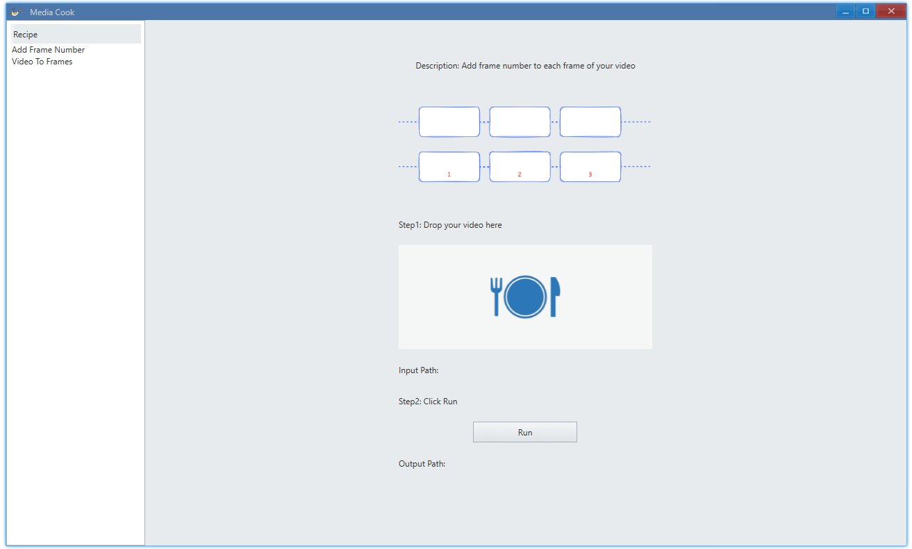

<p align="center">
    
</p>

<h1 align="center">Media Cook</h1>

<div align="center">

 </div>
 
# Introduction

A simple frontend for ffmpeg powered by [Avernakis UI](https://qber-soft.github.io/Ave-Nodejs-Docs/).



## Dev

Download `ffmpeg.exe` and place it at `./lib/ffmpeg.exe`.

You can find the ffmpeg build we use here: [tag/lib](https://github.com/rerender2021/ave-ffmpeg-gui/releases/tag/lib).

```bash
> npm install
> npm run dev
```

## Package

```bash
> npm run release
```

## License

[MIT](./LICENSE)
